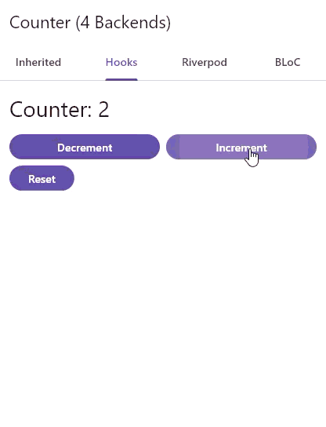
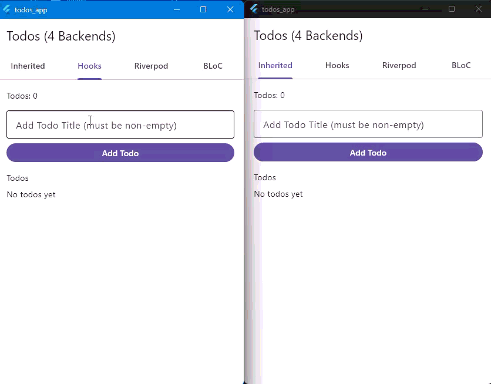
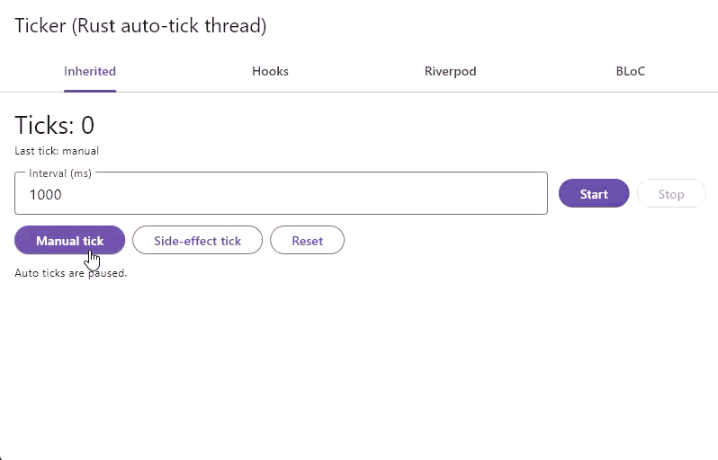
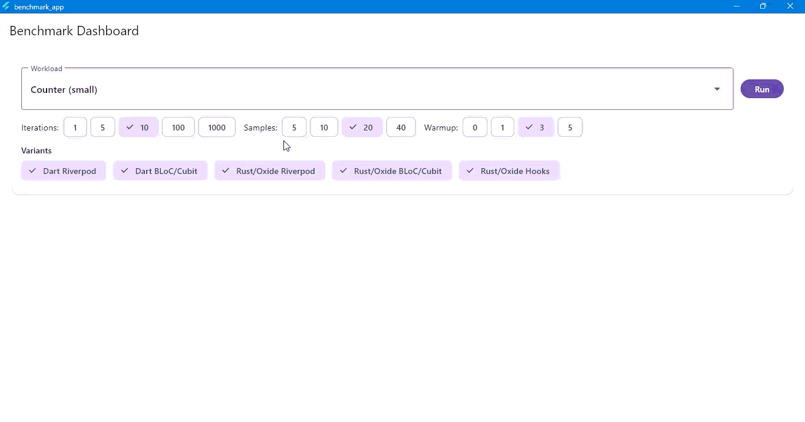
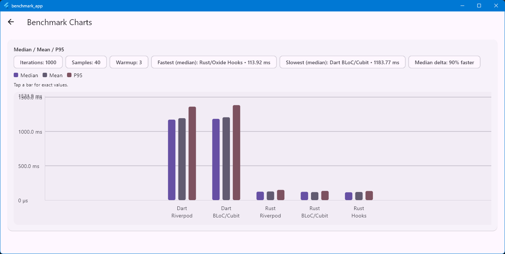

# Oxide

[](https://github.com/Oxide-Stack/Oxide/actions/workflows/ci.yml)
[](https://github.com/Oxide-Stack/Oxide/actions/workflows/release.yml)
[](LICENSE)
[](https://github.com/Oxide-Stack/Oxide/tags)

Oxide is a Rust ↔ Flutter workflow for building apps where:

- Rust owns state and business logic (reducers).
- Flutter stays UI-first and consumes typed bindings plus generated adapters.

This repository is structured so **package code stays usage-agnostic**, and complete runnable usage lives under [examples/](./examples).

## Acknowledgements

Oxide is powered by [Flutter Rust Bridge (FRB)](https://github.com/fzyzcjy/flutter_rust_bridge). Huge thanks to the FRB maintainers and contributors for making Rust ↔ Dart interoperability approachable and productive.
## ✨ Why Oxide

- Keep business logic and state invariants in Rust.
- Stream revisioned snapshots to Flutter for reactive UI updates.
- Generate the boring wiring code (InheritedWidget / Riverpod / BLoC adapters) from a small annotation.
- Preserve a key invariant: failed reducer calls must not partially mutate live state.

## 🧠 Mental Model

Oxide implements a Redux-like unidirectional flow:

```
UI event -> Action -> dispatch(Action) -> reducer(&mut State, Action)
        -> if success: state updated + revision++ + snapshot emitted
        -> Flutter observes snapshot stream -> rebuilds UI
```

Snapshots are revisioned:

```rust
pub struct StateSnapshot<T> {
  pub revision: u64,
  pub state: T,
}
```

## 📦 Packages

### Rust

- [oxide_core](./rust/oxide_core) — store/engine primitives, snapshot streams, error model, optional persistence
- [oxide_macros](./rust/oxide_macros) — ergonomic macros for state/actions/reducers (`#[state]`, `#[actions]`, `#[reducer]`)

### Flutter

- [oxide_annotations](./flutter/oxide_annotations) — `@OxideStore(...)` annotation + `OxideBackend` enum
- [oxide_generator](./flutter/oxide_generator) — build_runner generator that produces backend glue (`*.oxide.g.dart`)
- [oxide_runtime](./flutter/oxide_runtime) — small runtime used by generated code (includes Riverpod helpers)

## 🚀 Examples (Start Here)

- [counter_app](./examples/counter_app) — smallest end-to-end store (counter reducer + snapshot stream)
- [todos_app](./examples/todos_app) — CRUD list state + errors + persistence
- [ticker_app](./examples/ticker_app) — periodic tick dispatch + snapshot stream into Flutter
- [benchmark_app](./examples/benchmark_app) — performance comparison against Dart-only approaches

## 🎬 Example Demos

Add your recordings under `docs/media/`:






## 📈 Benchmark Results

Full write-up and more charts: [docs/BENCHMARKS.md](./docs/BENCHMARKS.md)



## 🧪 Quickstart (Run An Example)

From the repo root:

```bash
cd examples/counter_app
flutter pub get
dart run build_runner build -d
flutter run
```

If you change the Rust API surface, regenerate Flutter Rust Bridge (FRB) bindings (still from the example directory):

```bash
flutter_rust_bridge_codegen generate --config-file flutter_rust_bridge.yaml
```

## 📚 Documentation

- Usage / integration guide: [docs/USAGE.md](./docs/USAGE.md)
- Contributing guide: [CONTRIBUTING.md](./CONTRIBUTING.md)

## 🛠️ Development

### Run Tests

- Rust crates: `cargo test` (from `./rust`)
- Flutter runtime package: `flutter test` (from `./flutter/oxide_runtime`)

### Repo Scripts

The repo keeps a single `VERSION` file and syncs versions via scripts under [tools/scripts/](./tools/scripts).

- Version sync: `tools/scripts/version_sync.ps1` / `tools/scripts/version_sync.sh`
- Tests: `tools/scripts/qa.ps1` / `tools/scripts/qa.sh`
- Builds (platform required): `tools/scripts/build.ps1 -Platform windows` / `tools/scripts/build.sh linux` (add `-NoExamples` / `--no-examples` to skip building examples)
- Git flow helpers: `tools/scripts/git_flow.ps1`, `tools/scripts/git_flow.sh`

## Versioning

- [VERSION](./VERSION) is the single source of truth.
- Scripts apply it to the Rust workspace, Flutter packages, and example apps.

## Non-Goals (Deferred)

- Offline-first behavior
- State replay/time-travel debugging

## Migration Notes

- Example apps previously named/split differently; use the current `examples/*` apps as the canonical references.
- `@OxideStore.actions` supports both enum actions and union-class actions (depending on your FRB mapping).
- Rust-side persistence is feature-gated; enable `state-persistence` on the relevant crates to use it.

## 🤝 Contributing

Issues and PRs are welcome — especially from first-time contributors. If you’re not sure where to start, pick an example app and try adding a small feature or polishing the docs.

- Read: [CONTRIBUTING.md](./CONTRIBUTING.md)
- Keep package code usage-agnostic; put runnable usage under `examples/`
- Add or update tests when you change core behavior

## 📜 License

Dual-licensed under MIT OR Apache-2.0. See [LICENSE](./LICENSE).

Some packages may also include their own license file (for example, `flutter/oxide_runtime/LICENSE`).
