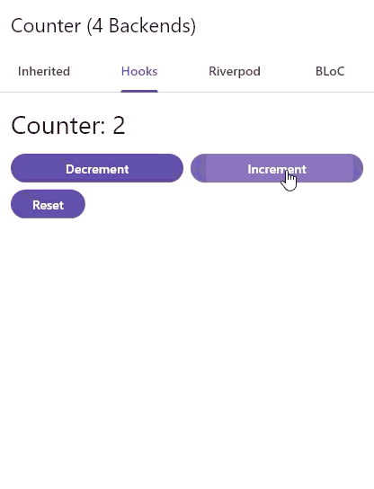
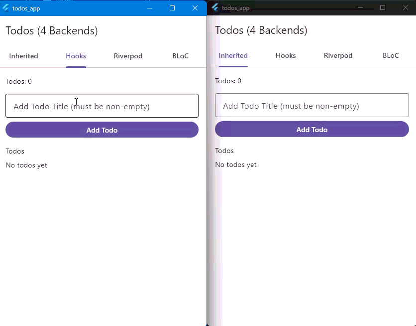
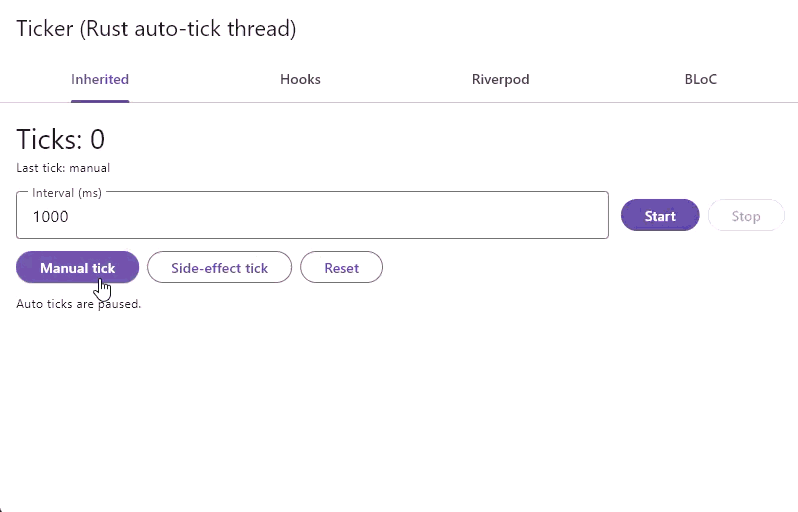
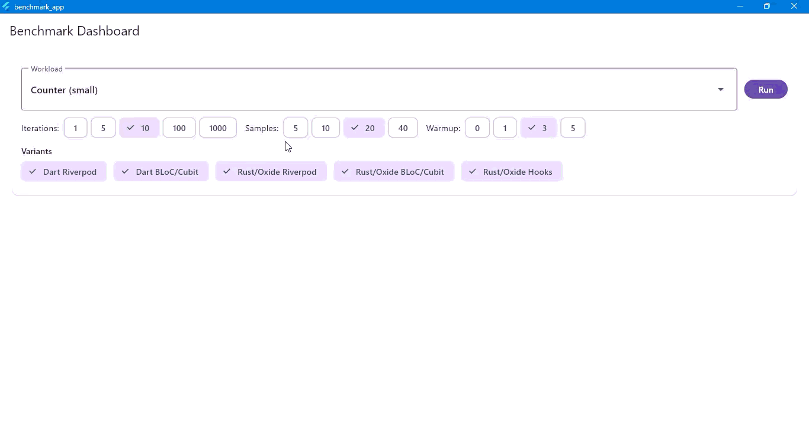
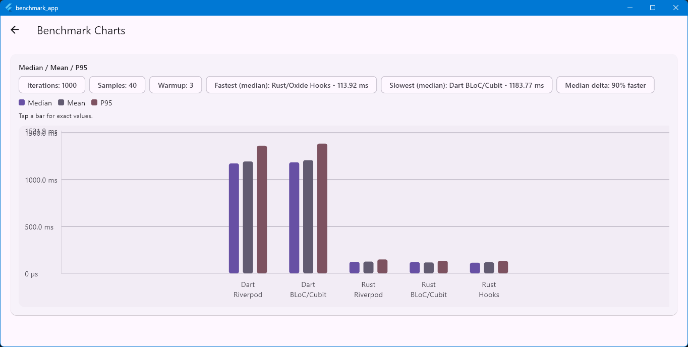

# Oxide

[](https://github.com/Oxide-Stack/Oxide/actions/workflows/ci.yml)
[](https://github.com/Oxide-Stack/Oxide/actions/workflows/test-suite.yml)
[](https://github.com/Oxide-Stack/Oxide/actions/workflows/release.yml)
[](LICENSE)
[](https://github.com/Oxide-Stack/Oxide/tags)
[](https://pub.dev/packages/oxide_annotations)
[](https://pub.dev/packages/oxide_generator)
[](https://pub.dev/packages/oxide_runtime)
[](https://crates.io/crates/oxide_core)
[](https://crates.io/crates/oxide_generator_rs)

Oxide is a Rust ↔ Flutter stack for apps where:

- Rust owns state and business logic (reducers).
- Flutter stays UI-first and consumes typed bindings plus generated adapters.

Package code stays usage-agnostic. Runnable integration lives in [examples/](./examples).

Architecture overview: [docs/ARCHITECTURE.md](./docs/ARCHITECTURE.md)

## Acknowledgements

Oxide is built on [Flutter Rust Bridge (FRB)](https://github.com/fzyzcjy/flutter_rust_bridge).

## What Oxide Gives You

- Keep business logic and state invariants in Rust.
- Stream revisioned snapshots to Flutter for reactive UI updates.
- Generate the repetitive wiring (InheritedWidget / Riverpod / BLoC adapters) from a small annotation.
- Preserve a key invariant: failed reducer calls must not partially mutate live state.

## Features

- Rust reducer engine with typed actions and revisioned snapshots.
- Sliced updates for targeted widget rebuilds.
- Optional Rust-driven navigation binding to Flutter (Navigator and GoRouter).
- Optional isolated channels for typed callback and duplex messaging.
- Optional state persistence (`state-persistence` feature flag).
- Generated Flutter adapters for InheritedWidget, Inherited Hooks, Riverpod, and BLoC.
- Unified initialization entrypoint with structured runtime logging.

Feature docs are indexed in [docs/usage/README.md](./docs/usage/README.md).

## Execution Flow

Oxide implements a Redux-like unidirectional flow:

```
UI event -> Action -> dispatch(Action) -> reducer(&mut State, Action)
        -> if success: state updated + revision++ + snapshot emitted
        -> Flutter observes snapshot stream -> rebuilds UI
```

Snapshots are revisioned:

```rust
pub struct StateSnapshot<T> {
  pub revision: u64,
  pub state: T,
  pub slices: Vec<StateSlice>,
}
```

## Sliced Updates

Sliced updates let Flutter stores rebuild only when specific *top-level* parts of state changed.

- **Rust**: opt in on your state with `#[state(sliced = true)]`. This generates a slice enum named `<StateName>Slice` (for example, `AppStateSlice`).
- **Rust reducer**: return `StateChange::Infer` (engine infers slices by comparing top-level fields) or `StateChange::Slices(&[...])` (explicit slices).
- **Snapshots**: `snapshot.slices` is empty for full updates (`StateChange::Full` / legacy `FullUpdate`). Non-empty slices indicate which segments changed.
- **Flutter**: use `@OxideStore(slices: [...])` to filter snapshots before they hit your chosen backend (InheritedWidget/Riverpod/BLoC).

## Packages

### Rust

- [oxide_core](./rust/oxide_core) — store/engine primitives, snapshot streams, error model, optional persistence
- [oxide_generator_rs](./rust/oxide_generator_rs) — ergonomic macros for state/actions/reducers (`#[state]`, `#[actions]`, `#[reducer]`)

### Flutter

- [oxide_annotations](./flutter/oxide_annotations) — `@OxideStore(...)` annotation + `OxideBackend` enum
- [oxide_generator](./flutter/oxide_generator) — build_runner generator that produces backend glue (`*.oxide.g.dart`)
- [oxide_runtime](./flutter/oxide_runtime) — small runtime used by generated code (includes Riverpod helpers)

## Examples

- [counter_app](./examples/counter_app) — smallest end-to-end store (counter reducer + snapshot stream)
- [todos_app](./examples/todos_app) — CRUD list state + errors + persistence
- [ticker_app](./examples/ticker_app) — periodic tick dispatch + snapshot stream into Flutter
- [benchmark_app](./examples/benchmark_app) — performance comparison against Dart-only approaches
- [showcase_app](./examples/showcase_app) — multi-feature end-to-end demo app
- [api_browser_app](./examples/api_browser_app) — browse a JSON API with multiple reducers

## Demos

Add your recordings under `docs/media/`:






## Benchmark Results

Full write-up and more charts: [docs/BENCHMARKS.md](./docs/BENCHMARKS.md)



## Quickstart

From the repo root:

```bash
cd examples/counter_app
flutter pub get
dart run build_runner build -d
flutter run
```

If you change the Rust API surface, regenerate Flutter Rust Bridge (FRB) bindings (still from the example directory):

```bash
flutter_rust_bridge_codegen generate --config-file flutter_rust_bridge.yaml
```

## Documentation

- Usage / integration guide: [docs/usage/README.md](./docs/usage/README.md)
- Contributing guide: [CONTRIBUTING.md](./CONTRIBUTING.md)

## Development

### Run Tests

- Rust crates: `cargo test` (from `./rust`)
- Flutter runtime package: `flutter test` (from `./flutter/oxide_runtime`)
- Web/WASM compatibility (Rust): see `rust/oxide_core` for target builds and test compilation instructions

### Repo Scripts

The repo keeps a single `VERSION` file and syncs versions via scripts under [tools/scripts/](./tools/scripts).

- Version sync: `tools/scripts/version_sync.ps1` / `tools/scripts/version_sync.sh`
- Tests: `tools/scripts/qa.ps1` / `tools/scripts/qa.sh`
- Builds (platform required): `tools/scripts/build.ps1 -Platform windows` / `tools/scripts/build.sh linux` (add `-NoExamples` / `--no-examples` to skip building examples)
- Disk cleanup: `tools/scripts/clean.ps1` / `tools/scripts/clean.sh` (add `-DryRun` / `--dry-run` to preview)
- Git flow helpers: `tools/scripts/git_flow.ps1`, `tools/scripts/git_flow.sh`

## Versioning

- [VERSION](./VERSION) is the single source of truth.
- Scripts apply it to the Rust workspace, Flutter packages, and example apps.

## Non-Goals

- Offline-first behavior
- State replay/time-travel debugging

## Migration Notes

- Example apps previously named/split differently; use the current `examples/*` apps as the canonical references.
- `@OxideStore.actions` supports both enum actions and union-class actions (depending on your FRB mapping).
- Rust-side persistence is feature-gated; enable `state-persistence` on the relevant crates to use it.

## Contributing

Issues and PRs are welcome — especially from first-time contributors. If you’re not sure where to start, pick an example app and try adding a small feature or polishing the docs.

- Read: [CONTRIBUTING.md](./CONTRIBUTING.md)
- Keep package code usage-agnostic; put runnable usage under `examples/`
- Add or update tests when you change core behavior

## License

Dual-licensed under MIT OR Apache-2.0. See [LICENSE](./LICENSE).

Some packages may also include their own license file (for example, `flutter/oxide_runtime/LICENSE`).
