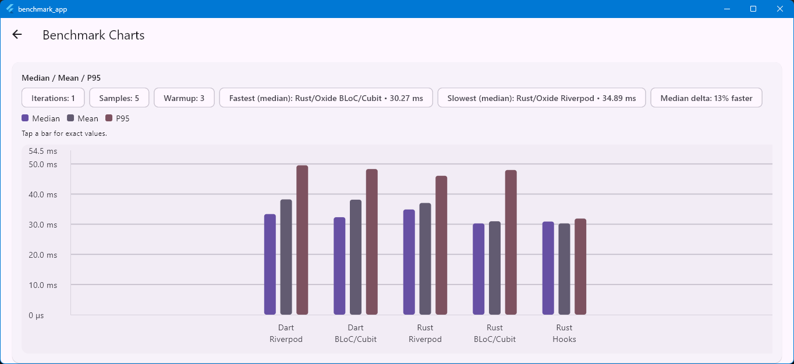
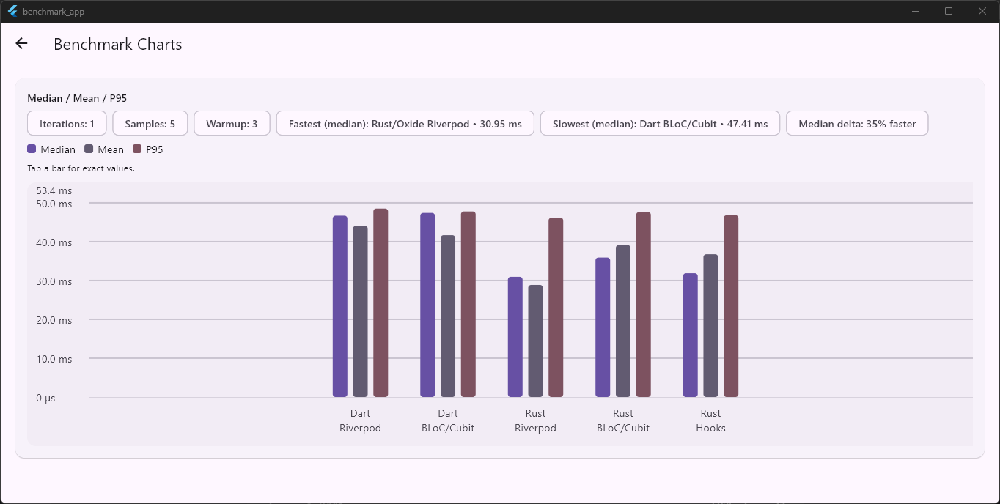
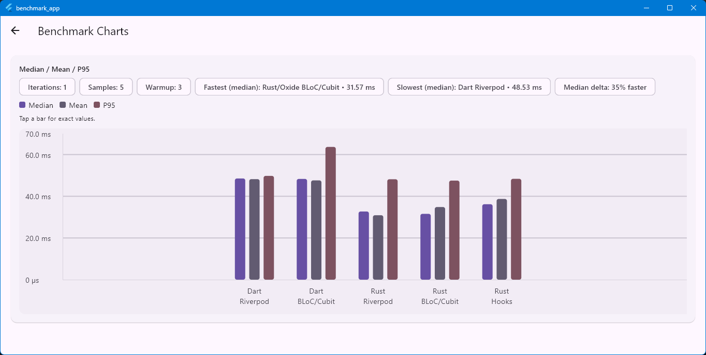
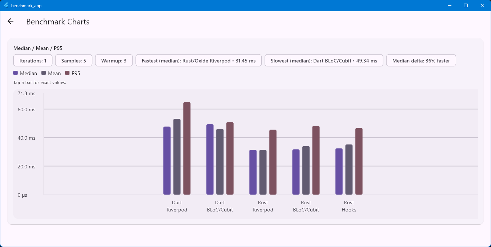
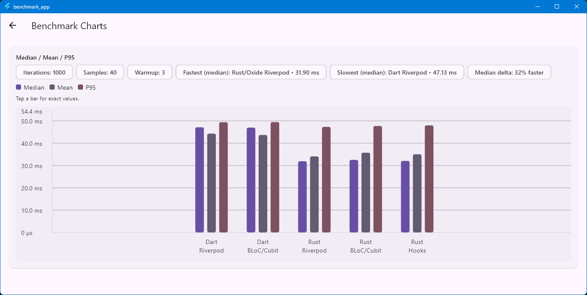
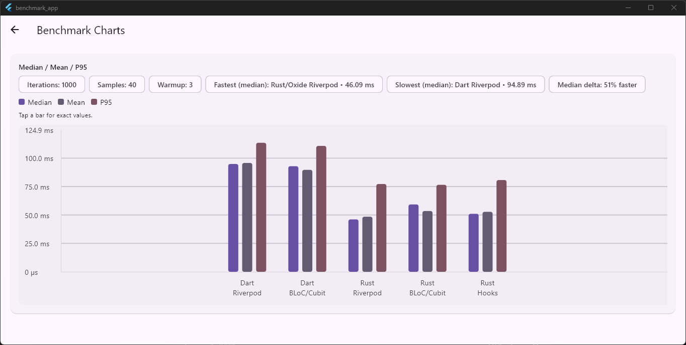
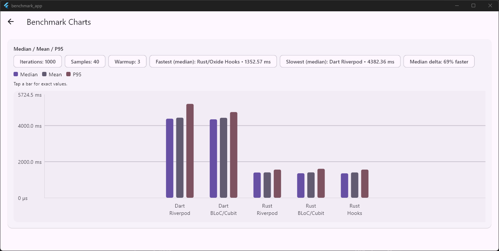

# Benchmarks

This repository includes a runnable benchmark app that compares “Dart-only” state updates against Rust/Oxide-backed state updates across multiple Flutter state management integrations.

For the runnable benchmark harness, see [examples/benchmark_app](../examples/benchmark_app).

## What Is Measured

Each recorded sample is an end-to-end wall time for one benchmark “action run” inside a Flutter app:

- Dispatch work for the selected variant
- State update work for the selected workload
- Waiting for a frame boundary (`endOfFrame`)

This makes the results useful for answering: “How does this approach behave inside a Flutter UI loop?”

## Variants

The benchmark app compares these variants:

- Dart Riverpod
- Dart BLoC/Cubit
- Rust/Oxide Riverpod
- Rust/Oxide BLoC/Cubit
- Rust/Oxide Hooks

## Workloads

The charts are grouped by workload:

- Counter (small): lightweight counter updates and hashing/mixing
- Sieve (CPU): deterministic prime-counting sieve (CPU-bound)
- JSON (light): decode → canonicalize → encode (smaller input)
- JSON (heavy): decode → canonicalize → encode (larger input)

## Runs, Warmup, Samples, And Intensity

The benchmark harness uses:

- Warmup runs (not recorded) to reduce “cold start” effects
- Multiple samples (recorded) to compute summary statistics
- Sequential execution (variants run one after another)

The charts in this repo are split into two “intensity” modes:

- Low intensity (`itr1_*`): one unit of work per measured action run
- High intensity (`itr1000_*`): 1000 units of work per measured action run

High intensity batches more work into a single action run, which tends to amortize fixed overheads (dispatch, framework glue, and any Rust↔Dart boundary costs).

## How To Read The Bars

Each chart shows three bars per variant:

- Median: typical run
- Mean: average run
- P95: tail latency; a rough proxy for worst-case behavior and jank risk

## Results Gallery

### Low Intensity (iterations = 1)

### High Intensity (iterations = 1000)

## Interpretation Guidance

- Prefer comparing medians when you care about typical responsiveness, and p95 when you care about tail latency and jank risk.
- Expect low-intensity results to be more sensitive to integration overhead (framework glue, dispatching, and Rust↔Dart boundaries). If the workload is tiny, overhead dominates.
- Expect high-intensity results to be more sensitive to raw compute cost (CPU and parsing). If the workload is heavy, batching and native performance can dominate.

## Where Oxide Fits vs Pure Dart

Oxide is a strong “replacement for pure Dart” for the parts of your app that are both performance-sensitive and correctness-sensitive:

- CPU-heavy business logic (algorithms, transforms, parsing pipelines)
- Complex domain invariants where you want Rust to own state and enforce consistency
- Work that benefits from batching into fewer dispatches that do more useful work per action

Oxide is usually not the best fit when:

- Your state updates are extremely small and extremely frequent (overheads can dominate)
- The logic is primarily UI orchestration (keep UI-first behavior in Flutter)

Practical advice:

- Move the expensive or invariant-heavy core into Rust reducers and keep UI composition in Flutter.
- Prefer actions that batch meaningful work per dispatch; avoid sending thousands of tiny actions across the boundary.

## Reproducing The Benchmarks

Run the benchmark app and use its dashboard to select iterations, warmup runs, and sample count:

- App: [examples/benchmark_app](../examples/benchmark_app)
- Notes on measurement fairness: [examples/benchmark_app/README.md](../examples/benchmark_app/README.md)

